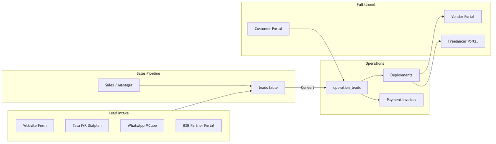
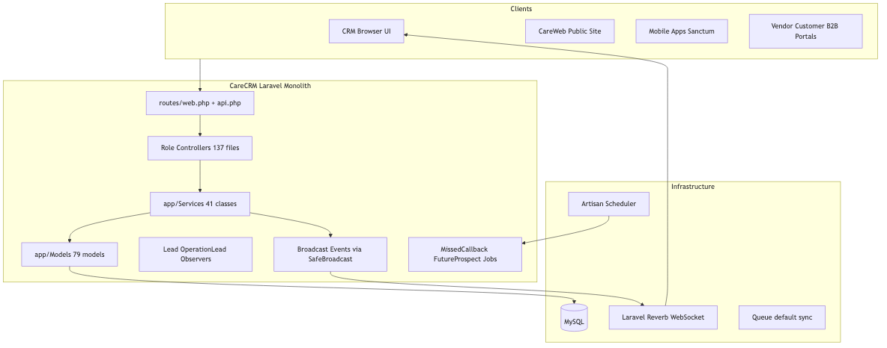
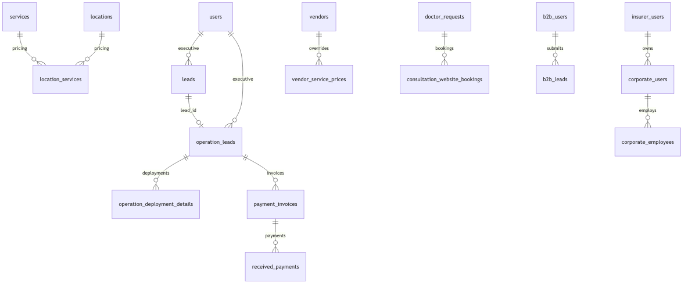
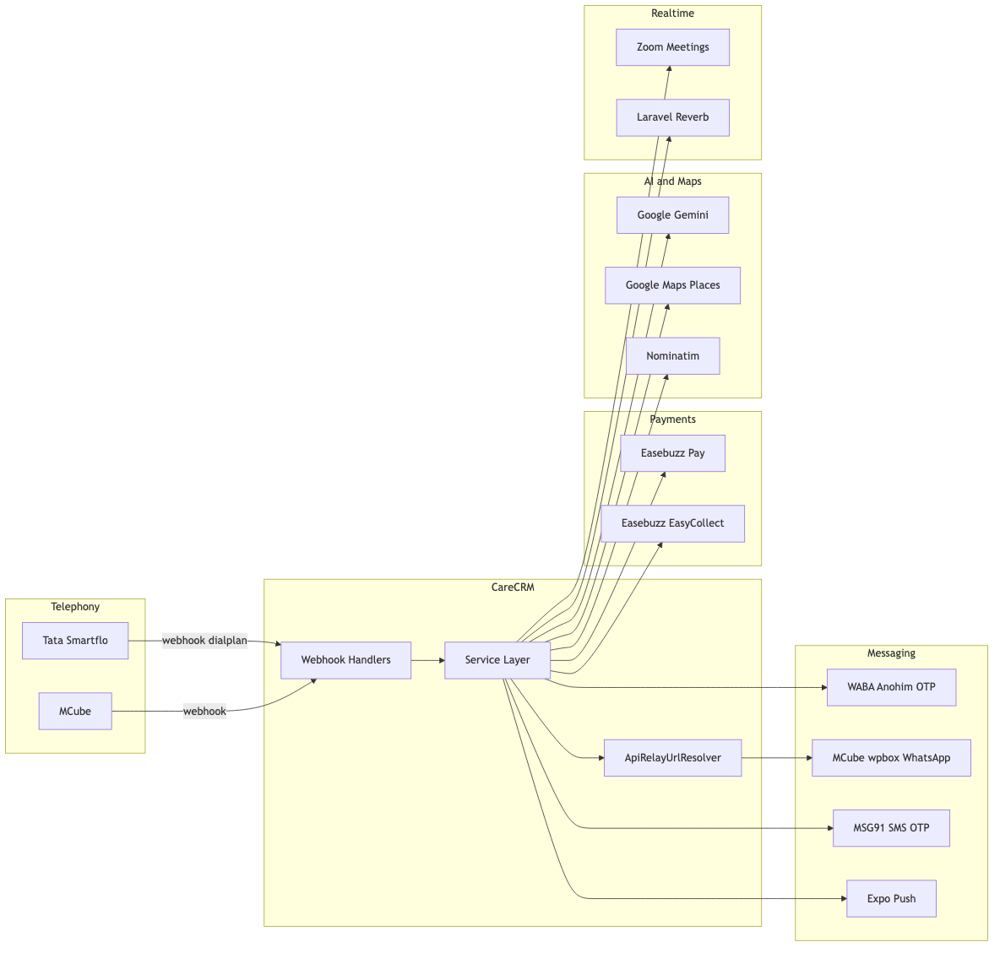
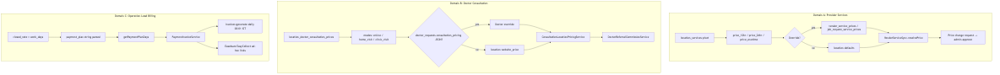

# CareCRM — Complete Wireframe & Architecture Reference

> **Document type:** Architecture / flow wireframe (not pixel-perfect UI mockups)  
> **Stack:** Laravel monolith · MySQL · Laravel Reverb · Queue (default: sync)  
> **Last verified against codebase:** June 2026

---

## Table of Contents

1. [System Overview](#1-system-overview)
2. [Access Models](#2-access-models)
3. [Employee Roles (CRM)](#3-employee-roles-crm)
4. [External Portals](#4-external-portals)
5. [Legacy / Dormant Roles](#5-legacy--dormant-roles)
6. [User Flow Diagrams](#6-user-flow-diagrams)
7. [System Architecture](#7-system-architecture)
8. [Database Schema](#8-database-schema)
9. [Role × Module Permission Matrix](#9-role--module-permission-matrix)
10. [API Integrations](#10-api-integrations)
11. [Pricing Engine](#11-pricing-engine)
12. [Scheduled Jobs & Commands](#12-scheduled-jobs--commands)
13. [Out of Scope](#13-out-of-scope)
14. [File Reference Appendix](#14-file-reference-appendix)

---

## 1. System Overview

CareCRM ek **Laravel monolith** hai jo home-care / attendant services, doctor consultation, aur B2B partner channel manage karta hai. Lead intake se service fulfillment tak ka end-to-end pipeline ek hi application mein chalta hai.

### Diagram 1 — End-to-End Pipeline




### Key Numbers (verified)

| Metric | Count |
|--------|-------|
| HTTP Controllers | 137 |
| Service classes | 41 |
| Eloquent models | 79 |
| Database migrations | 163 |
| `web.php` route groups | ~1,500 lines |
| `api.php` routes | ~1,100 lines |

---

## 2. Access Models

CareCRM mein **do alag access models** hain:

### A. Employee Roles (`users` + `roles`)

- Login: OTP (WhatsApp WABA) → multi-role select → `session('logged_role')`
- Guard: `RoleMiddleware` — route group par `role:Admin`, `role:Sales`, etc.
- Hierarchy: `users.parent_id` — Manager → Executive assignment chain
- Lead routing: `UserAssignmentService` (round-robin by role, location, `lead_type`)

**Source:** `app/Http/Controllers/AuthController.php`, `app/Http/Middleware/RoleMiddleware.php`

### B. Portal Identities (separate tables + session auth)

- Vendor, Customer, Freelancer, Doctor, B2B partners, Insurer/Broker/Corporate — alag tables
- OTP ya username/password auth; `users` table se linked nahi
- Admin in accounts ko create/manage karta hai

---

## 3. Employee Roles (CRM)

### 3.1 Admin — `/admin`

| Field | Value |
|-------|-------|
| **Hindi label** | व्यवस्थापक — पूर्ण प्लेटफ़ॉर्म नियंत्रण |
| **Middleware** | `auth`, `role:Admin` |
| **Primary kaam** | Full platform control — leads, ops, users, providers, billing, config |

**Sidebar modules:** Dashboard, Payments, Leads, Users, B2B Users, Corporate/Individual (B2B) hub, Insurer & Broker (Insurers, Brokers, Corporate Accounts, Corporate Employees), Break Logs, Duty Logs, Operation Leads, Locations, Services, Registration Languages, Doctor (Verify No., Doctor requests, Consultation services, Website payments), All Chats (Chat, All Staff Chats, Customer Chats), WhatsApp, All Freelancer & Vendor (Vendor/Freelancer verify, payments, attendance, Job Request), Technical Support

**Key routes:** `admin.dashboard`, `admin.leads.*`, `admin.operation_leads.*`, `admin.users.*`, `admin.vendors.*`

---

### 3.2 Sales — `/sales`

| Field | Value |
|-------|-------|
| **Hindi label** | बिक्री कार्यकारी — लीड कैप्चर और रूपांतरण |
| **Middleware** | `auth`, `role:Sales` |
| **Primary kaam** | Lead capture, status updates, AI remarks, convert to operation lead |

**Sidebar modules:** Dashboard, Payments, Leads (CRUD + AI status remarks), Chat, B2B Corporate Chat (conditional), WhatsApp, Technical Support

**Scope:** Assigned leads via `UserAssignmentService`; own `executive_id` filter

---

### 3.3 Sales Manager — `/manager`

| Field | Value |
|-------|-------|
| **Hindi label** | बिक्री प्रबंधक — टीम पर्यवेक्षण |
| **Middleware** | `auth`, `role:Sales Manager` |
| **Primary kaam** | Team lead oversight, staff chat monitoring, subordinate user mgmt |

**Sidebar modules:** Dashboard, Leads (team scope via `parent_id`), Chat, B2B Corporate Chat (conditional), Sales Staff Chats, WhatsApp, Break Logs, Duty Logs, Users (subordinates only), Technical Support

**Hierarchy:** `users.parent_id` — manager sees subordinates' leads

---

### 3.4 Operation — `/operation`

| Field | Value |
|-------|-------|
| **Hindi label** | संचालन कार्यकारी — सेवा पूर्ति |
| **Middleware** | `auth`, `role:Operation` |
| **Primary kaam** | Operation lead fulfillment — deployments, invoices, vendor/freelancer assignment |

**Sidebar modules:** Dashboard, Payments, Operation Leads, Chat, B2B Corporate Chat (conditional), Job-Request, WhatsApp, Technical Support

---

### 3.5 Operation Manager — `/operation-manager`

| Field | Value |
|-------|-------|
| **Hindi label** | संचालन प्रबंधक — ऑप्स टीम प्रबंधन |
| **Middleware** | `auth`, `role:Operation Manager` |
| **Primary kaam** | Ops team management, coordinator chat oversight |

**Sidebar modules:** Dashboard, Operation Leads, Job Requests, Chat, B2B Corporate Chat (conditional), Operation Staff Chats, WhatsApp, Team, Break Logs, Duty Logs, Technical Support

---

### 3.6 B2B (Employee) — Legacy note

`RoleMiddleware` mein `'B2B' => 'b2b.dashboard'` mapping hai, lekin **active `role:B2B` route group nahi hai**. B2B access ab **portal auth** (`b2b.auth`, `b2b.corporate.auth`, etc.) se hota hai — Section 4 dekhein.

---

## 4. External Portals

| Portal | Table | Auth | Prefix | Primary Kaam |
|--------|-------|------|--------|--------------|
| **Vendor** | `vendors` | OTP (`vendor.auth`) | `/vendor` | Assigned leads, payments, customer chat, attendance, bank/KYC |
| **Freelancer** | `job_requests` | OTP | `/freelancer` | Documents, assigned leads, chats, payments |
| **Customer** | `leads` / `operation_leads` | OTP | `/customer` | Dashboard, chats, payments, service requests, attendance |
| **Doctor Portal** | `doctor_requests` | OTP + admin approval | `/doctor-portal` | Availability, bookings, profile, customer chats |
| **B2B Legacy** | `b2b_users` | OTP (`b2b.auth`) | `/b2b` | Submit leads (legacy partner type) |
| **B2B Corporate** | `b2b_users` (corporate) | OTP (`b2b.corporate.auth`) | `/b2b-corporate` | Corporate dashboard + chat with CRM staff |
| **B2B Individual** | `b2b_users` (individual) | OTP (`b2b.individual.auth`) | `/b2b-individual` | Individual partner dashboard |
| **B2B Reference** | `b2b_reference_users` | OTP (`b2b.reference.auth`) | `/b2b-reference` | Read-only referral lead view |
| **Doctor Referral** | `doctor_referral_users` | OTP (`doctor.referral.auth`) | `/doctor-referral` | Referral dashboard, commission tracking |
| **Insurer** | `insurer_users` | Username/password | `/insurer` | Manage corporates & employees |
| **Broker** | `broker_users` | Username/password | `/broker` | Manage corporates & employees |
| **Corporate** | `corporate_users` | Username/password | `/corporate` | Employee bulk import, roster CRUD |
| **Corporate Employee** | `corporate_employees` | Username/password | `/corporate/employee` | Employee self-service dashboard |

**Admin creates portal accounts via:** `Admin/B2BUserController`, `Admin/InsurerUserController`, `Admin/BrokerUserController`, `Admin/CorporateUserController`, `Admin/DoctorReferralUserController`, `Admin/B2BReferenceUserController`, `Admin/VendorController`, etc.

---

## 5. Legacy / Dormant Roles

Yeh roles ke **Blade views aur sidebars exist karte hain**, lekin `routes/web.php` mein **inactive route groups nahi milte** (verified: no `role:TPA`, `role:SubAdmin`, `role:Doctor`, etc.):

| Role | View path | Status |
|------|-----------|--------|
| TPA | `resources/views/tpa/` | Legacy — inactive routes |
| SubAdmin | `resources/views/subadmin/` | Legacy — inactive routes |
| Doctor (claims) | `resources/views/doctor/` | Legacy — inactive routes |
| Bill | `resources/views/bill/` | Legacy — inactive routes |
| Lab | `resources/views/lab/` | Legacy — inactive routes |
| Dispatcher | `resources/views/dispatcher/` | Legacy — inactive routes |
| MedicineVital | `resources/views/medicinevital/` | Legacy — inactive routes |
| PostSales | `resources/views/postsales/` | Legacy — inactive routes |

In modules se related models/tables (`cases`, `tickets`, `tpa_cases`, `courier`, etc.) database mein ab bhi maujood hain — insurance/claims pipeline ke liye.

---

## 6. User Flow Diagrams

### Diagram 2 — Primary User Journeys


### Journey Details & Key Files

| # | Journey | Key files |
|---|---------|-----------|
| 1 | Sales Lead Lifecycle | `routes/api.php` (webhooks), `Sales/LeadController.php`, `Concerns/HandlesLeadStatusRemarks.php`, `LeadStatusRemarkAiService.php` |
| 2 | Operation Lead Fulfillment | `Operation/OperationLeadController.php`, `PaymentInvoiceService.php`, `OperationDeploymentDetails` model |
| 3 | Doctor Consultation Booking | `Api/PublicConsultationBookingController.php`, `ConsultationLocationPricingService.php`, `EasebuzzPaymentService.php` |
| 4 | B2B Partner Lead Submission | `B2B/B2BLeadController.php`, `B2BLeadJourneyService.php`, `Crm/B2BCorporateChatController.php` |
| 5 | Vendor/Freelancer Onboarding | `Auth/RegisterController.php`, `RegistrationOtpService.php`, `VendorServiceSync.php` |
| 6 | Customer Portal | `Customer/CustomerController.php`, `Api/CustomerController.php` |
| 7 | Missed Callback Automation | `MissedCallbackSequenceService.php`, `RunMissedCallbackAttemptJob`, `TataService.php` |
| 8 | Manager Team Oversight | `Manager/LeadController.php`, `manager/staff.chats` routes |

### Role-specific actions on same lead

| Action | Admin | Sales | Sales Mgr | Operation | Op Mgr |
|--------|-------|-------|-----------|-----------|--------|
| View all leads | ✓ | Own | Team | — | — |
| Edit lead status + AI remarks | ✓ | ✓ | ✓ | — | — |
| Convert to operation lead | ✓ | ✓ | ✓ | — | — |
| Manage deployments | ✓ | — | — | ✓ | ✓ |
| Generate/view invoices | ✓ | View links | — | ✓ | ✓ |
| Assign vendor/freelancer | ✓ | — | — | ✓ | ✓ |

---

## 7. System Architecture

### Diagram 3 — Layered Architecture




### Layer breakdown

| Layer | Responsibility | Location |
|-------|----------------|----------|
| **Routes** | HTTP entry, middleware, role guards | `routes/web.php`, `routes/api.php` |
| **Controllers** | Request handling, view/API responses | `app/Http/Controllers/` (137 files) |
| **Services** | Business logic, external HTTP | `app/Services/` (41 classes) |
| **Models** | Eloquent ORM, relationships | `app/Models/` (79 models) |
| **Observers** | Lead call status, side effects | `app/Observers/LeadObserver.php`, etc. |
| **Jobs** | Async: missed callbacks, future prospect reminders | `app/Jobs/` |
| **Events** | Real-time via Reverb | `app/Events/`, `app/Support/SafeBroadcast.php` |

### Auth flow (employees)

```
OTP send (WABA) → OTP verify → role list from user.roles
→ session('logged_role') = selected role_id
→ redirect to role dashboard (RoleMiddleware on subsequent requests)
```

---

## 8. Database Schema

### Diagram 4 — Entity Relationship (Hub Entities)




### Table groups (75+ tables)

| # | Group | Key tables |
|---|-------|------------|
| 1 | **Auth & Staff** | `users`, `roles`, `locations` |
| 2 | **Sales** | `leads`, `lead_status_remarks`, `call_logs`, `call_details` |
| 3 | **Operations** | `operation_leads`, `operation_deployment_details`, `deployment_location_attendances`, `deployment_absent_adjustments` |
| 4 | **Providers** | `vendors`, `job_requests`, `vendor_payments`, `freelancer_payments` |
| 5 | **Service Catalog & Pricing** | `services`, `service_sub_services`, `location_services`, `vendor_service_prices`, `job_request_service_prices` |
| 6 | **Doctor / Consultation** | `doctor_requests`, `consultation_website_bookings`, `location_doctor_consultation_prices`, `doctor_consultation_services` |
| 7 | **B2B & Corporate** | `b2b_users`, `b2b_leads`, `b2b_chat_messages`, `insurer_users`, `broker_users`, `corporate_users`, `corporate_employees` |
| 8 | **Billing** | `payment_invoices`, `received_payments`, `easebuzz_payment_links`, `operation_leads_payment_details` |
| 9 | **Communications** | `messages`, `groups`, `group_messages`, `customer_chat_messages`, `whatsapp_messages` |
| 10 | **Legacy Claims** | `cases`, `tickets`, `tpa_cases`, `courier`, `vendor_cases` |

---

## 9. Role × Module Permission Matrix

### Access levels

| Level | Meaning |
|-------|---------|
| **Full** | CRUD + admin config |
| **Manage** | CRUD on assigned/team scope |
| **View** | Read-only |
| **Own** | Only own records |
| **Conditional** | Flag-based (`showB2bCorporateStaffChat`, `is_ticket_enabled`, etc.) |
| **None** | No access |
| **Legacy** | Views exist, routes inactive |
| **Portal** | Separate portal auth (not employee role) |

### Per-user flags (not role-based)

`is_ticket_enabled`, `is_courier_enabled`, `is_query_enabled`, `lead_type`, `location_id`, `services`, `parent_id`, B2B chat peer assignments (`b2b_user_chat_peers`)

### Matrix

| Module | Admin | Sales | Sales Mgr | Operation | Op Mgr | Vendor | Customer | B2B Corp |
|--------|-------|-------|-----------|-----------|--------|--------|----------|----------|
| Dashboard | Full | Own | Team | Own | Team | Portal | Portal | Portal |
| Sales Leads | Full | Manage | Manage | None | None | None | None | None |
| Operation Leads | Full | None | None | Manage | Manage | None | View | None |
| Payments (Easebuzz links) | Full | Manage | None | Manage | None | View | View | None |
| Deployments | Full | None | None | Manage | Manage | Own | View | None |
| Invoices | Full | View | None | Manage | Manage | None | View | None |
| Users Mgmt | Full | None | Subordinates | None | Subordinates | None | None | None |
| Vendors / Freelancers | Full | None | None | Assign | Assign | Portal | None | None |
| Doctors | Full | None | None | None | None | None | Chat | None |
| B2B Mgmt | Full | None | None | None | None | None | None | Portal |
| Insurer/Broker/Corporate | Full | None | None | None | None | None | None | None |
| Chat (internal) | Full | Own | Own + Staff | Own | Own + Coord | None | None | None |
| WhatsApp | Full | Manage | Manage | Manage | Manage | None | None | None |
| Group Chat | Full | Own | Own | Own | Own | None | None | None |
| B2B Corporate Chat | Conditional | Conditional | Conditional | Conditional | Conditional | None | None | Portal |
| Attendance | Full | None | None | View | View | Own | View | None |
| Break/Duty Logs | Full | None | Team | None | Team | None | None | None |
| Tasks | Full | Own | Team | Own | Team | None | None | None |
| Job Requests | Full | None | None | Manage | Manage | None | None | None |
| Location/Services Config | Full | None | None | None | None | None | None | None |
| Languages | Full | None | None | None | None | None | None | None |
| Tickets (legacy) | Legacy | Legacy | Legacy | Legacy | Legacy | None | None | None |
| Cases (legacy) | Legacy | Legacy | Legacy | Legacy | Legacy | None | None | None |

---

## 10. API Integrations

### Diagram 5 — External Services Map




### Integration reference table

| Service | Purpose | Key service file |
|---------|---------|------------------|
| **Tata Smartflo** | Telephony, click-to-call, IVR dialplan | `TataService.php`, `OutboundCall.php` |
| **MCube** | Legacy calls + WhatsApp wpbox | `MCubeService.php` |
| **WABA (Anohim)** | WhatsApp OTP login | `WabaLoginOtpService.php` |
| **Easebuzz Pay** | Consultation checkout | `EasebuzzPaymentService.php` |
| **Easebuzz EasyCollect** | CRM payment links | `EasebuzzEasyCollectService.php` |
| **Google Gemini** | AI remarks, translation, doctor About | `GeminiService.php`, `LeadStatusRemarkAiService.php` |
| **MSG91** | Registration SMS OTP | `RegistrationOtpService.php` |
| **Google Maps** | Places autocomplete | `GooglePlacesService.php` |
| **Nominatim** | Address fallback | `NominatimAddressService.php` |
| **Expo Push** | Mobile notifications | `ExpoNotificationService.php` |
| **Zoom** | Online consultation meetings | Controllers (env direct) |
| **Laravel Reverb** | Real-time WebSocket | `SafeBroadcast.php` |

### Webhook entry points (`routes/api.php`)

| Endpoint | Handler |
|----------|---------|
| `POST /api/tatateleservices-webhook` | `TataController::handleCallWebhook` |
| `GET /api/tatateleservices-dialplan` | IVR dialplan closure |
| `POST /api/mcube/webhook` | `MCubeController::handleCallWebhook` |
| `POST /api/wa-submit` | WhatsApp inbound message handler |
| `POST /api/form-submit` | Website form → lead creation |

### ApiRelay pattern

`ApiRelayUrlResolver.php` — environments jahan direct egress blocked hai, external API calls proxy URL se resolve hote hain.

**Config:** `config/services.php`, `.env.example`

---

## 11. Pricing Engine

### Diagram 6 — Three Independent Pricing Domains




> **Note:** Teen alag pricing domains hain — koi unified pricing engine nahi.

### Domain A — Provider Services (Vendor/Freelancer)

- **Rate card:** `location_services` pivot (`price_12hr`, `price_24hr`, `price_onetime`)
- **Dimensions:** location × service × sub-service × `provider_type`
- **Override hierarchy:** `vendor_service_prices` → vendor JSON → location defaults
- **Change workflow:** Price change requests → admin approve
- **Resolver:** `VendorServiceSync::resolvePrice`, `JobRequestFreelancerServiceSync`

### Domain B — Doctor Consultation

- **Rate card:** `location_doctor_consultation_prices` (modes: online, home_visit, clinic_visit)
- **Override:** `doctor_requests.consultation_pricing` JSON
- **Patient fee resolution:** Doctor override → location `website_price` → doctor flat charge
- **Resolver:** `ConsultationLocationPricingService.php`
- **Commission:** `DoctorReferralCommissionService.php`

### Domain C — Operation Lead Billing

- **Not a catalog** — contractual per-day: `closed_rate` × `work_days`
- **Payment plan:** parsed string ("15 day advance", "monthly") → `getPaymentPlanDays()`
- **Invoice gen:** `PaymentInvoiceService.php` — scheduled daily via `invoices:generate`
- **Ad-hoc links:** Easebuzz EasyCollect (separate from invoice engine)

---

## 12. Scheduled Jobs & Commands

Defined in `app/Console/Kernel.php` (timezone: `Asia/Kolkata`):

| Command | Schedule | Purpose |
|---------|----------|---------|
| `invoices:generate` | Daily at 00:01 | Generate payment invoices for due operation leads |
| `leads:dispatch-future-prospect-reminders` | Every minute | Fallback for future prospect reminder jobs |
| `missed-callback:run-due` | Every minute | Execute due missed callback retry attempts |

---

## 13. Out of Scope

- **UI pixel-perfect wireframes** — yeh architecture/flow wireframe hai, visual design mockup nahi
- **Live database schema dump** — legacy tables ke liye `php artisan db:table` se exact columns verify kar sakte hain
- **CareWeb frontend codebase** — agar alag repo hai, sirf CareCRM integration points document kiye gaye hain

---

## 14. File Reference Appendix

### Routes & access

| File | Purpose |
|------|---------|
| `routes/web.php` | Employee + portal web routes, middleware groups |
| `routes/api.php` | Webhooks, public APIs, Sanctum mobile endpoints |
| `app/Http/Middleware/RoleMiddleware.php` | `session('logged_role')` guard |

### Auth

| File | Purpose |
|------|---------|
| `app/Http/Controllers/AuthController.php` | OTP login, multi-role select, portal auth |
| `app/Services/WabaLoginOtpService.php` | WhatsApp OTP for CRM login |
| `app/Services/RegistrationOtpService.php` | MSG91 OTP for registration |

### Sidebars (per-role navigation)

| Role | Sidebar blade |
|------|---------------|
| Admin | `resources/views/admin/layouts/sidebar.blade.php` |
| Sales | `resources/views/sales/layouts/sidebar.blade.php` |
| Sales Manager | `resources/views/manager/layouts/sidebar.blade.php` |
| Operation | `resources/views/operation/layouts/sidebar.blade.php` |
| Operation Manager | `resources/views/operation_manager/layouts/sidebar.blade.php` |
| Vendor | `resources/views/vendor/layouts/sidebar.blade.php` |
| Customer | `resources/views/customer/layouts/sidebar.blade.php` |
| Freelancer | `resources/views/freelancer/layouts/sidebar.blade.php` |

### Lead & operation controllers

| File | Purpose |
|------|---------|
| `app/Http/Controllers/Sales/LeadController.php` | Sales lead CRUD |
| `app/Http/Controllers/Manager/LeadController.php` | Manager team leads |
| `app/Http/Controllers/Admin/LeadController.php` | Admin all leads |
| `app/Http/Controllers/Operation/OperationLeadController.php` | Ops fulfillment |
| `app/Http/Controllers/OperationManager/OperationLeadController.php` | Ops manager view |
| `app/Http/Controllers/Concerns/HandlesLeadStatusRemarks.php` | AI status remarks trait |
| `app/Services/LeadStatusRemarkAiService.php` | Gemini-powered remarks |
| `app/Services/UserAssignmentService.php` | Round-robin lead assignment |

### Pricing

| File | Purpose |
|------|---------|
| `app/Services/VendorServiceSync.php` | Provider price resolution |
| `app/Services/ConsultationLocationPricingService.php` | Doctor consultation fees |
| `app/Services/PaymentInvoiceService.php` | Operation lead invoicing |
| `app/Services/DoctorReferralCommissionService.php` | Referral commissions |

### Integrations

| File | Purpose |
|------|---------|
| `app/Services/TataService.php` | Tata Smartflo API |
| `app/Services/MCubeService.php` | MCube telephony + WhatsApp |
| `app/Services/EasebuzzPaymentService.php` | Consultation payments |
| `app/Services/EasebuzzEasyCollectService.php` | CRM payment links |
| `app/Services/GeminiService.php` | Google Gemini AI |
| `app/Services/MissedCallbackSequenceService.php` | Missed call retry logic |
| `app/Services/ApiRelayUrlResolver.php` | Egress proxy resolver |
| `app/Support/SafeBroadcast.php` | Reverb broadcast wrapper |

### B2B & corporate

| File | Purpose |
|------|---------|
| `app/Http/Controllers/B2B/B2BLeadController.php` | B2B portal leads |
| `app/Http/Controllers/Crm/B2BCorporateChatController.php` | CRM-side B2B chat |
| `app/Services/B2BLeadJourneyService.php` | B2B → CRM lead bridge |
| `app/Http/Controllers/Admin/B2BUserController.php` | Admin B2B account mgmt |
| `app/Http/Controllers/Admin/InsurerUserController.php` | Insurer accounts |
| `app/Http/Controllers/Admin/BrokerUserController.php` | Broker accounts |
| `app/Http/Controllers/Admin/CorporateUserController.php` | Corporate accounts |

### Public APIs (CareWeb / mobile)

| File | Purpose |
|------|---------|
| `app/Http/Controllers/Api/PublicConsultationBookingController.php` | Doctor booking + payment |
| `app/Http/Controllers/Api/PublicConsultationWebsiteController.php` | Public consultation data |
| `app/Http/Controllers/Api/CustomerController.php` | Customer mobile API |
| `app/Http/Controllers/Api/AuthController.php` | Sanctum mobile auth |

### Models (hub entities)

| File | Purpose |
|------|---------|
| `app/Models/Lead.php` | Sales lead |
| `app/Models/OperationLead.php` | Operation lead |
| `app/Models/User.php` | CRM employee |
| `app/Models/Vendor.php` | Vendor provider |
| `app/Models/JobRequest.php` | Freelancer |
| `app/Models/DoctorRequest.php` | Doctor provider |
| `app/Models/B2BUser.php` | B2B partner |
| `app/Models/PaymentInvoice.php` | Billing invoice |
| `app/Models/ConsultationWebsiteBooking.php` | Website consultation booking |

### Database

| Path | Purpose |
|------|---------|
| `database/migrations/` | 163 migration files |
| `config/services.php` | External service credentials/config |

---

*Generated as part of CareCRM wireframe documentation.*
